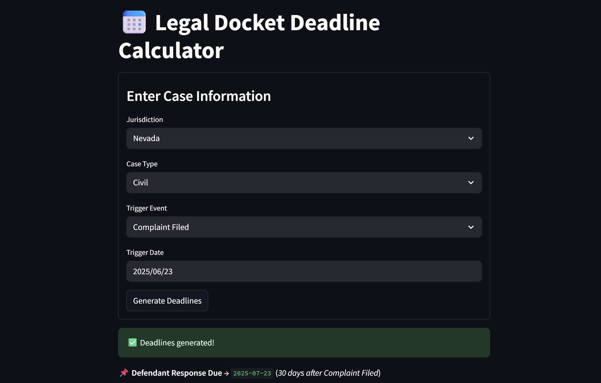

# 📅 DocketRocket

**Auto-Docketing & Court Deadline Calculator for Lawyers**

DocketRocket is a lightweight legal deadline calculator that helps lawyers, paralegals, and legal assistants avoid missed deadlines by automatically calculating court-specific legal due dates based on jurisdiction, case type, and event date.

---

## 🚀 Features

- ✅ Supports **all 50 U.S. states**
- 🗓️ Auto-generates deadlines from event trigger dates (e.g. “Complaint Filed”)
- 📂 Configurable deadline rules per state via YAML
- 📄 Export-ready frontend via Streamlit
- ⚡ FastAPI backend with dynamic rule engine
- 🧠 Easily extendable to new jurisdictions, case types, and rules
- 🧪 Built for legal tech prototyping, portfolio projects, and real use

---

## 🖥️ Preview



---

## 📦 Tech Stack

| Layer       | Tech                                     |
| ----------- | ---------------------------------------- |
| Frontend    | Streamlit                                |
| Backend     | FastAPI                                  |
| Data Rules  | YAML (per state)                         |
| HTTP Client | httpx                                    |
| Utilities   | `us` Python package for 50-state mapping |

---

## 🧰 Getting Started

### 1. Clone the Repo

```bash
git clone https://github.com/your-username/docketrocket.git
cd docketrocket
```

### 2. Install Requirements

```bash
pip install -r requirements.txt
```

### 3. Generate Rules for All 50 States

```bash
python autoYAMLer.py
```

### 4. Start Backend (FastAPI)

```bash
cd backend
uvicorn main:app --reload
```

### 5. Start Frontend (Streamlit)

In a new terminal tab:

```bash
cd frontend
streamlit run streamlit_app.py
```

---

## 📁 Project Structure

```
docketrocket/
├── backend/
│   ├── main.py                # FastAPI API server
│   ├── models.py              # Request/response schemas
│   ├── rules/                 # All state-specific deadline YAMLs
│   └── autoYAMLer.py          # Script to generate basic rules for all 50 states
├── frontend/
│   └── streamlit_app.py       # Streamlit frontend UI
├── requirements.txt
└── README.md
```

---

## 🛠 Example Rule File: `rules/virginia_civil.yaml`

```yaml
jurisdiction: "Virginia"
case_type: "Civil"
rules:
  - event: "Complaint Filed"
    deadlines:
      - name: "Defendant Response Due"
        offset_days: 21
      - name: "Service of Process Deadline"
        offset_days: 120
```

---

## 🌟 Roadmap

- [x] Support 50 states
- [ ] Add criminal and family case types
- [ ] User account system
- [ ] Deadline export to Google Calendar/Outlook
- [ ] Web deployment (Render, Railway, etc.)
- [ ] Rule editor UI (no-code)

---

## 🤝 Contributing

Pull requests welcome! If you’d like to contribute a better rule set for your state, just open a PR or submit a YAML file to `/rules`.

---

## 📜 License

MIT License

---

## 👋 Created by

**Jake Priddy**
[LinkedIn](https://linkedin.com/in/jakepriddy) | [GitHub](https://github.com/jakepriddy) | [Medium](https://medium.com/@0xJake)
